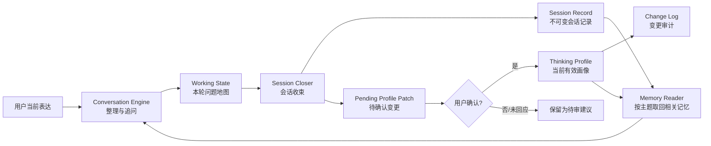
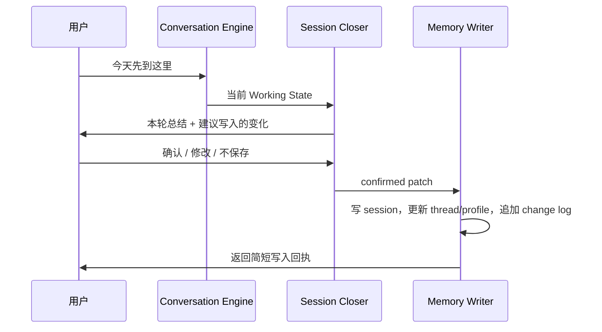

# Review Your Thinking Skill — MVP 架构

## 1. 一句话定义

这个 Skill 不替用户得出答案，而是帮助用户在长期、多轮对话中：

1. 把模糊想法变成可继续追问的问题；
2. 区分主张、假设、证据、概念和矛盾；
3. 保存用户认可的思维模型；
4. 记录这些模型后来如何被修正、替代或放弃。

项目名：`review-your-thinking`。

## 2. 产品边界

### 2.1 它是什么

- 一个长期协作的思维整理协议；
- 一个可回看、可修订、可删除的个人思维档案；
- 一个通过追问、复述、对照和重构来促进思考的对话 Skill。

### 2.2 它不是什么

- 不做心理咨询、诊断或危机干预的替代品；
- 不做人格分类、MBTI、能力评分或性格定型；
- 不扮演权威导师，不替用户决定“正确答案”；
- 不把一次表达升级为稳定特征；
- 不默默积累无限量原始聊天记录；
- 不把关于第三方的敏感信息写入长期画像。

### 2.3 核心契约

> AI 可以提出关于用户思维的假设，但只有用户可以确认什么代表自己。

因此，系统必须始终区分三种状态：

- `observed`：本轮对话中可直接定位的表达或变化；
- `proposed`：AI 根据证据提出、等待用户确认的整理；
- `confirmed`：用户明确认可、可以进入长期画像的内容。

这三个状态不能混写。

## 3. MVP 要解决的使用场景

### 场景 A：从混乱到可讨论

用户说：“我脑子里有很多关于工作的想法，但不知道自己到底在纠结什么。”

Skill 的目标不是给职业建议，而是帮助用户得到一个当前问题地图：问题、假设、冲突、未知项和下一步值得追问的点。

### 场景 B：继续过去的思考

用户说：“继续上次关于稳定和自由的讨论。”

Skill 应能恢复相关思维线索，明确说明“上次停在哪里”，并从未解决的张力继续，而不是重新采访用户。

### 场景 C：识别观点变化

用户说：“我现在对成功的理解是不是和以前不同？”

Skill 应基于有来源的旧记录做时间对照，指出变化和仍然未变的部分，不进行人格推断。

### 场景 D：结束并保存

用户说：“今天先到这里，帮我收一下。”

Skill 应生成本轮思维摘要、待确认的画像变更和下一次入口；确认后再写入长期画像。

## 4. 总体架构



架构分成四个职责，避免一个大 Prompt 同时完成所有事情：

1. **Conversation Engine**：只负责当下对话质量；
2. **Memory Reader**：只加载当前问题需要的少量历史；
3. **Session Closer**：把本轮变化整理为结构化候选；
4. **Memory Writer**：校验确认状态后再更新文件，并留下变更记录。

## 5. Skill 包结构

v0.1-base 仓库保持小而清晰：

```text
review-your-thinking/
├── README.md
├── SKILL.md
├── ARCHITECTURE.md
├── schemas/
│   ├── profile.schema.json
│   ├── thread.schema.json
│   ├── session.schema.json
│   └── patch.schema.json
├── references/
│   ├── conversation-protocol.md
│   ├── memory-contract.md
│   ├── thinking-profile-schema.md
│   ├── update-policy.md
│   └── safety-boundaries.md
├── scripts/
│   └── memory_store.py
└── examples/
    ├── sample-profile.yaml
    ├── sample-thread.yaml
    ├── sample-session.md
    └── sample-patch.yaml
```

各部分职责：

| 组件 | 职责 | 不应该包含 |
|---|---|---|
| `SKILL.md` | 触发条件、主流程、按需读取哪些 reference | 完整 schema、大量例子、长篇原则说明 |
| `conversation-protocol.md` | 单轮与多轮对话状态机、可用的追问动作 | 长期记忆字段定义 |
| `memory-contract.md` | 记忆分层、读取范围、隐私和删除规则 | 对话措辞 |
| `thinking-profile-schema.md` | Profile、Thread、Session、Patch 的字段约束 | 产品宣言 |
| `update-policy.md` | 何时提出、确认、合并、冲突和撤销变更 | 自由发挥的画像推断 |
| `safety-boundaries.md` | 非咨询、非诊断、敏感信息和风险升级边界 | 一般对话策略 |
| `memory_store.py` | 初始化、校验、收束会话、应用已确认变更和准备历史审查材料 | 生成心理解释或替模型做判断 |

MVP 只保留一个脚本，减少维护面。v0.1-base 提供五个确定性动作：

```text
init      初始化用户数据目录
close     写入 session record 和 pending patch
apply     将用户确认的 patch 原子地应用到 profile
review    把用户明确提供的 session records 整理成历史对照草稿
validate  校验 schema、引用和 revision
```

脚本只处理数据完整性，不决定“用户是什么样的人”。语义判断仍由对话协议完成。

## 6. 用户 Memory 的存储设计

### 6.1 数据不能放在 Skill 目录

Skill 目录是程序，用户记忆是数据。两者必须分离，否则升级或重装 Skill 时可能覆盖用户记录。

默认在当前工作空间创建：

```text
.review-your-thinking/
├── profile.yaml
├── threads.yaml
├── pending-profile-patch.yaml
├── changes.jsonl
├── past-review-draft.md
└── sessions/
    └── 2026-07-04T103000+0800__work-and-freedom.md
```

未来可以支持用户指定其他目录，但 MVP 不做数据库、不做向量检索、不做云同步。

### 6.2 四层记忆

#### L0：Working State

- 仅存在于当前对话上下文；
- 保存本轮问题地图和刚刚发生的重构；
- 不自动成为长期画像。

#### L1：Session Record

- 一次对话的不可变摘要；
- 是长期更新的证据来源；
- 记录思维发生了什么变化，不保存完整聊天转录。

建议字段：

- session id、时间、关联 thread；
- 用户本轮真正想处理的问题；
- 初始 framing 与结束 framing；
- 新增、修正、放弃的主张或概念；
- 仍未解决的张力和未知项；
- 最多 1–3 条必要的用户原话锚点；
- 待确认的 profile patch；
- 下一次最自然的继续入口。

#### L2：Thinking Profile

- 用户当前认可的、跨会话仍有价值的思维模型；
- 是可变的“当前投影”，不是永恒真相；
- 每个条目必须能追溯到 session id。

#### L3：Change Log

- 追加式审计记录；
- 记录谁在何时基于什么证据，新增、修改、废弃或删除了哪个对象；
- 支持解释“为什么现在的画像和以前不同”。

### 6.3 为什么不直接保存完整聊天

- 噪声太大，后续检索会把偶发表达误当成稳定观点；
- 隐私成本高；
- 用户难以审计；
- Profile 容易被模型的旧回复污染。

MVP 只保存结构化摘要和少量必要原话。原话必须来自用户，AI 自己的总结不能冒充用户证据。

## 7. Thinking Profile 的模型

### 7.1 Profile 只存什么

```yaml
schema_version: 1
profile_revision: 7
updated_at: 2026-07-04T11:30:00+08:00

collaboration_preferences:
  - id: cp-001
    statement: "先帮我澄清问题，再给外部信息"
    status: confirmed
    evidence: [session-2026-07-04-01]

definitions:
  - id: def-success
    term: "成功"
    current_definition: "拥有可持续的自主选择权"
    status: confirmed
    evidence: [session-2026-07-04-01]

working_models:
  - id: model-autonomy
    label: "自主性模型"
    claim: "自由不是没有约束，而是能理解并选择约束"
    scope: "职业与生活决策"
    status: confirmed
    supporting_evidence: [session-2026-07-04-01]
    counter_evidence: []
    supersedes: null

recurring_inquiry_moves:
  - id: move-mechanism
    observation: "讨论抽象判断时，用户倾向于继续追问背后的机制"
    status: confirmed
    evidence: [session-2026-06-20-01, session-2026-07-04-01]

unresolved_tensions:
  - id: tension-stability-freedom
    poles: ["稳定", "自由"]
    current_formulation: "想保留安全边界，同时不愿用全部自主性换取确定性"
    status: confirmed
    evidence: [session-2026-07-04-01]

long_term_questions:
  - id: question-good-work
    question: "什么样的工作值得长期投入？"
    why_it_matters: "它连接职业选择、成长和自主性"
    status: active
    evidence: [session-2026-07-04-01]
```

示例只是 schema 形状，不是 Prompt，也不是对真实用户的推断。

### 7.2 Profile 明确不存什么

- “你是一个理性/敏感/回避型的人”这类人格标签；
- 心理疾病、依恋类型、创伤推断；
- 单次情绪、随口一说的偏好、AI 猜测的动机；
- 与当前思维合作无关的身份信息；
- 未经同意的第三方隐私；
- 无来源的置信度分数。

### 7.3 Profile 与 Thread 的区别

`profile.yaml` 保存跨话题仍有价值的当前模型；`threads.yaml` 保存正在推进的具体问题。

Thread 的最小结构：

```yaml
- id: thread-work-and-freedom
  title: "工作中的稳定与自由"
  status: active
  current_question: "我愿意用多少自主性换取确定性？"
  current_framing: "不是二选一，而是最低安全边界与自主空间的配置问题"
  assumptions: []
  tensions: [tension-stability-freedom]
  unknowns: ["最低安全边界具体是多少"]
  next_probe: "把安全边界写成可观察条件"
  linked_models: [model-autonomy]
  session_refs: [session-2026-07-04-01]
```

这种拆分可防止 Profile 被每个临时项目和问题塞满。

## 8. 对话结束后的更新流程

### 8.1 关键现实限制

普通 Skill 无法保证在用户关闭窗口后继续自动执行。没有平台级 `after_chat` hook 时，“聊天结束以后更新”必须依赖用户显式说“收束/结束/保存本轮”。

因此 MVP 支持两条路径。

### 8.2 显式收束路径（MVP 主路径）



写入顺序：

1. 生成 Session Record；
2. 从本轮内容生成 `pending-profile-patch.yaml`；
3. 向用户展示“新增 / 修改 / 不写入”的简短候选；
4. 用户确认后，校验 `profile_revision`；
5. 原子更新 Profile 和 Threads；
6. 追加 Change Log；
7. 返回写入回执和下次入口。

### 8.3 无显式收束路径

若宿主以后提供 `after_chat` hook：

- 可以自动写入状态为 `unreviewed` 的 Session Record；
- 可以生成 `proposed` 的 Pending Patch；
- 不可自动把内容提升为 `confirmed` Profile；
- 下一次开始时先用一句话提示有待审变更，再由用户决定。

若宿主没有 hook，本轮不承诺持久化。Skill 应在适当时机轻量提醒一次，而不是每轮催促用户保存。

### 8.4 变更准入规则

| 情况 | Session | Pending Patch | Profile |
|---|---:|---:|---:|
| 本轮出现一次的新想法 | 写入 | 可提出 | 不写入 |
| 用户明确说“这是我现在的看法” | 写入 | 提出 | 用户确认后写入 |
| 多次对话重复出现 | 写入 | 提醒可能是稳定模式 | 仍需用户确认 |
| AI 推测用户动机或人格 | 不作为事实写入 | 不提出 | 禁止写入 |
| 新观点与旧观点冲突 | 写入 | 提出 revision/supersede | 确认后保留演变关系 |
| 用户要求忘记 | 按范围删除或脱敏 | 清除 | 删除并留下无内容 tombstone |

“重复出现”只能提高提醒优先级，不能替代用户确认。

### 8.5 冲突与修订

新观点不能静默覆盖旧观点。Profile 条目使用：

- `supersedes`：新模型替代哪个旧模型；
- `status: retired`：旧模型不再代表当前看法；
- session evidence：变化发生在哪次对话；
- Change Log：记录 before/after 和用户确认。

这样，“用户改变了想法”会成为有价值的历史，而不是数据错误。

## 9. 对话运行状态机

MVP 每轮只做一个主要动作，避免像审讯或一次抛出十个问题。

```text
ORIENT
  找到用户此刻真正想整理的对象
    ↓
MAP
  区分问题、主张、假设、证据、定义、张力、未知项
    ↓
PROBE
  选择一个最有信息增益的追问
    ↓
REFRAME
  用用户语言提出一个更准确的表达，并请用户校正
    ↓
DEVELOP / CLOSE
  继续展开，或进入会话收束
```

Conversation Engine 可选的“思维动作”只有少量几种：

- `clarify`：把模糊词变成可讨论的定义；
- `separate`：拆开混在一起的多个问题；
- `surface-assumption`：指出当前推理依赖的假设；
- `contrast`：比较两个相近但不同的表达；
- `trace-change`：对照过去与现在的 framing；
- `test-boundary`：询问一个观点在什么条件下不成立；
- `synthesize`：暂时收束为用户可修改的模型。

默认优先复述和追问。只有用户明确请求外部知识时，才短暂进入“提供信息”模式，并把外部信息与用户自己的判断分开。

## 10. Prompt 模块拆分

这一阶段不写具体 Prompt，只定义模块接口和加载条件。

| 模块 | 解决的问题 | 输入 | 输出 | 加载时机 |
|---|---|---|---|---|
| Identity & Non-goals | Skill 是谁、不是什么 | 用户请求 | 行为边界 | 始终 |
| Conversation Controller | 当前处于哪种对话状态 | 最近对话、Working State | 下一动作类型 | 每轮 |
| Inquiry Moves | 如何澄清、拆分、对照、追问 | 下一动作类型 | 一个高价值回应 | 按需 |
| Memory Retrieval | 该读哪些过去内容 | topic/thread/实体 id | 有来源的最小历史包 | 新会话或换题时 |
| Memory Interpretation | 历史如何参与当前对话 | 最小历史包 | “过去观点 vs 当前表达” | 需要纵向比较时 |
| Session Closing | 如何结束并形成候选记忆 | Working State | Session + Pending Patch | 用户收束时 |
| Update Policy | 什么能进入 Profile | Pending Patch、确认状态 | 合法 patch 或拒绝原因 | 写入前 |
| Safety Boundary | 何时停止画像化并切换边界响应 | 敏感表达、风险信号 | 安全响应模式 | 命中条件时 |
| Response Style | 如何保持像思维伙伴而非问卷 | 动作结果 | 简洁自然语言 | 每轮 |

模块组合原则：

- `SKILL.md` 只做路由和状态机，不塞入所有模块全文；
- Memory schema 和更新规则按需读取；
- 正常对话不加载完整 Change Log，只读取当前 thread、关联模型和少量最近 session；
- Closing 与日常对话使用不同模块，防止每轮都像在填档案。

## 11. Memory 读取策略

MVP 不需要向量数据库。使用结构化 id、关键词和受限的最近记录即可：

1. 若用户给出 thread 名称或 id，直接读取该 thread；
2. 读取 thread 关联的模型与 tension；
3. 最多读取最近 3 个关联 Session Record；
4. 若用户问“我以前是否……”，再扩展读取 Change Log；
5. 所有历史陈述都带来源，不确定时明确说未找到足够记录。

每次提供给模型的 Memory Context 应有固定预算，避免长期使用后 Prompt 无限增长。

## 12. 隐私、控制权和删除

MVP 必须提供四个用户动作：

- “你记住了什么？”：展示当前 Profile 和活跃 Threads；
- “这条不准确”：创建修订，而不是争辩；
- “忘记这件事”：删除指定对象及可识别内容；
- “今天不要保存”：本轮不进入持久化流程。

删除敏感内容时，Change Log 只保留对象 id、删除时间和“用户要求删除”，不保留被删除的原文。

## 13. MVP 验收标准

### 对话质量

- 面对混乱表达，先形成问题地图，不直接输出建议清单；
- 一轮通常只提出一个主要问题；
- AI 的重述始终允许用户修改；
- 不使用人格、病理或导师式结论。

### 长期连续性

- 能从指定 thread 恢复“上次停在哪里”；
- 能用 session evidence 对比观点变化；
- 旧观点被修订时仍保留演变链；
- 未确认内容不会进入 Profile。

### 数据完整性

- 每个 Profile 条目至少有一个有效 session reference；
- 每次写入增加 `profile_revision`；
- Patch revision 冲突时停止并重新读取，不覆盖新数据；
- `validate` 能发现断链引用和非法状态；
- 用户记忆与 Skill 安装目录完全分离。

## 14. 明确不进入 MVP 的内容

- embedding / 向量数据库；
- 自动聚类用户全部历史；
- 人格维度、分数、雷达图；
- 后台定时分析；
- 多设备云同步；
- 自动读取其他应用或私人文件；
- 多 Agent 辩论；
- 根据“用户画像”推荐人生决策；
- 未经确认自动更新稳定画像。

## 15. 推荐实施顺序

1. 固定四种 schema：Profile、Thread、Session、Patch；
2. 编写 Memory Contract 和 Update Policy；
3. 实现 `memory_store.py` 的 `init / close / apply / validate`；
4. 编写最小 `SKILL.md` 和 Conversation Protocol；
5. 用四个 MVP 场景做前向测试；
6. 根据真实使用调整 Prompt 模块，而不是先追求复杂 Prompt。

第一个可运行版本只需要证明两件事：

1. 它确实能让一次对话中的问题变得更清楚；
2. 它能在不擅自定义用户的前提下，把一次思考接到下一次。
