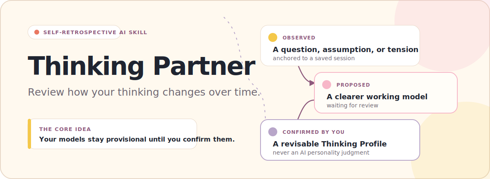
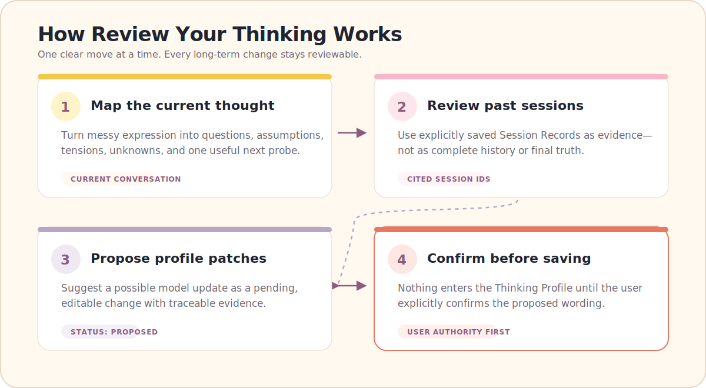
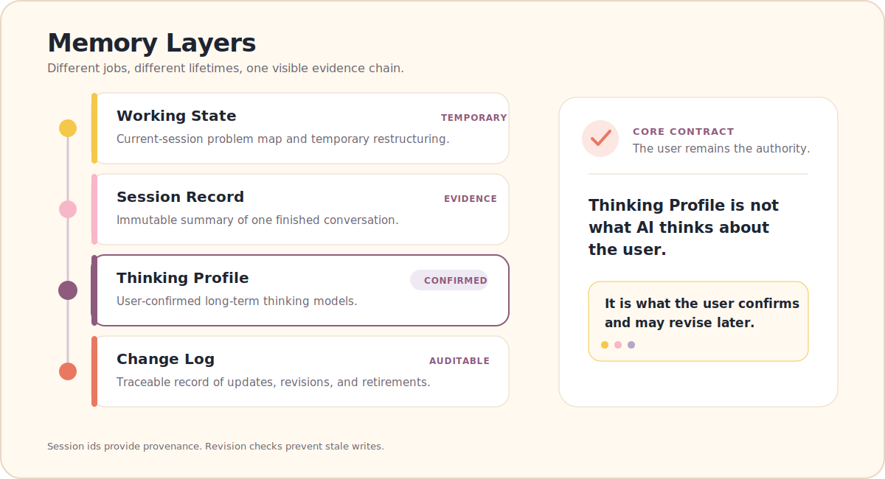

<p align="right">
  English | <a href="./README.zh-CN.md">中文</a>
</p>

<p align="center">
  
</p>

<h1 align="center">Review Your Thinking</h1>
<p align="center"><strong>A self-retrospective skill for long-term AI conversations.</strong></p>

<p align="center">
  
  
  
</p>

> Most AI tools help you get better answers.  
> Review Your Thinking helps you review how your questions, assumptions, definitions, and thinking models change over time.

## What it is — and what it is not

| What it is | What it is not |
|---|---|
| A lightweight skill protocol | Therapy |
| A way to review saved AI conversation sessions | Personality analysis or MBTI |
| A tool for mapping questions, assumptions, tensions, and definitions | A life coach or diagnosis tool |
| A user-confirmed Thinking Profile system | A raw chat log collector |

## Why this exists

AI is already good at answering questions. But after a long conversation, the useful part is often not the answer itself. It is how the user redefined the question, corrected an assumption, changed a concept, or formed a new working model.

Review Your Thinking keeps those changes inspectable across sessions without turning them into a hidden assessment of the user.

## How it works

<p align="center">
  
</p>

Past sessions are evidence records—not raw memory dumps, complete history, or final truth.

## Before / After

**Before**

```text
I have too many thoughts about work and freedom, but I don't know what I'm actually stuck on.
```

Review Your Thinking does not jump to career advice. It first makes the thought easier to inspect:

| Part | Working map |
|---|---|
| **Question** | Am I choosing between stability and freedom, or defining the conditions under which they can coexist? |
| **Assumption** | More stability always means less freedom. |
| **Tension** | Reliable security versus meaningful autonomy. |
| **Unknown** | What is the minimum security boundary I actually need? |
| **Next probe** | Which constraint would feel acceptable if it protected future choice? |

**Possible pending Patch**

```text
Proposed model:
Freedom may mean having room to choose constraints, not having no constraints.
```

> This does not enter the Thinking Profile until the user confirms it.

## Core concepts

<p align="center">
  
</p>

> **Thinking Profile is not what AI thinks about the user.**  
> It is a set of thinking models the user has confirmed and may revise later.

The system keeps three states separate:

- `observed` — traceable to a specific Session Record;
- `proposed` — organized by AI and waiting for review;
- `confirmed` — explicitly accepted by the user.

`proposed` never becomes `confirmed` automatically.

## Quick start

Requires Python 3.10+ and [PyYAML](https://pyyaml.org/).

<details>
<summary>Install the YAML dependency</summary>

```bash
python -m pip install PyYAML
```

</details>

```bash
python scripts/memory_store.py init
python scripts/memory_store.py close examples/sample-session.md
python scripts/memory_store.py review examples/sample-past-session-01.md examples/sample-past-session-02.md
python scripts/memory_store.py validate
```

| Command | Result |
|---|---|
| `init` | Creates the local `.review-your-thinking/` memory store. |
| `close` | Saves a structured Session Record and its pending Patch. |
| `review` | Prepares `past-review-draft.md` from selected Session Records; it does not interpret or confirm them. |
| `validate` | Checks store structure, revisions, statuses, and basic evidence links. |

User data stays under `.review-your-thinking/` and is ignored by Git.

## Repository structure

```text
.
├── assets/
│   ├── hero-en.svg
│   ├── hero-zh.svg
│   ├── workflow-en.svg
│   ├── workflow-zh.svg
│   ├── memory-layers-en.svg
│   └── memory-layers-zh.svg
├── examples/
├── references/
├── schemas/
│   ├── profile.schema.json
│   ├── thread.schema.json
│   ├── session.schema.json
│   └── patch.schema.json
├── scripts/
│   └── memory_store.py
├── tests/
│   └── acceptance/
├── ARCHITECTURE.md
├── README.md
├── README.zh-CN.md
└── SKILL.md
```

## Acceptance tests

This project includes acceptance tests to prevent the skill from drifting into:

- generic journaling;
- personality analysis;
- therapy-like responses;
- one-session overfitting;
- automatic Profile updates without user confirmation.

See [`tests/acceptance/`](./tests/acceptance/).

## Current status

**v0.1-base. Experimental. Work in progress.**

The repository provides a runnable local memory workflow and an AI Skill protocol. It does not provide background chat access, automatic semantic analysis, cloud sync, or a hosted application.

## Contributing

The most useful contributions right now are:

- messy thought examples;
- past Session Review examples;
- cases where the Skill over-inferred;
- cases where proposed Profile Patches felt wrong;
- better acceptance tests;
- documentation improvements.

## License

License: TBD
