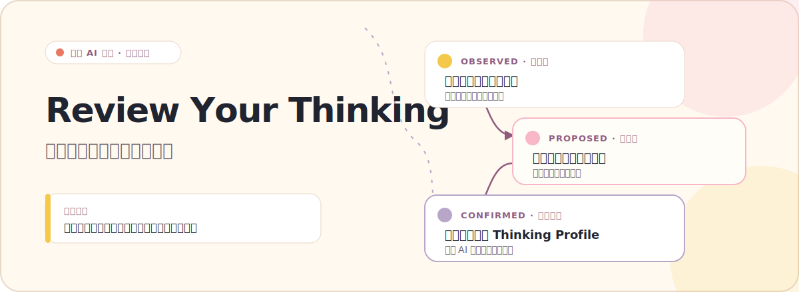
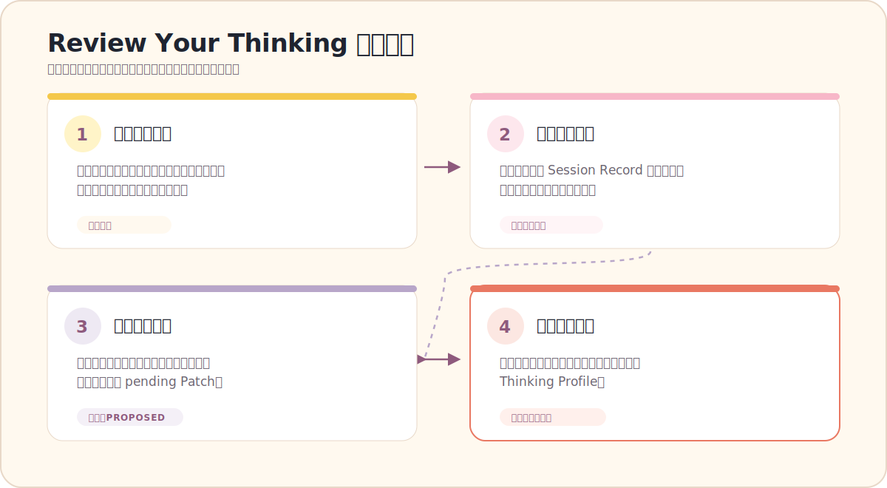
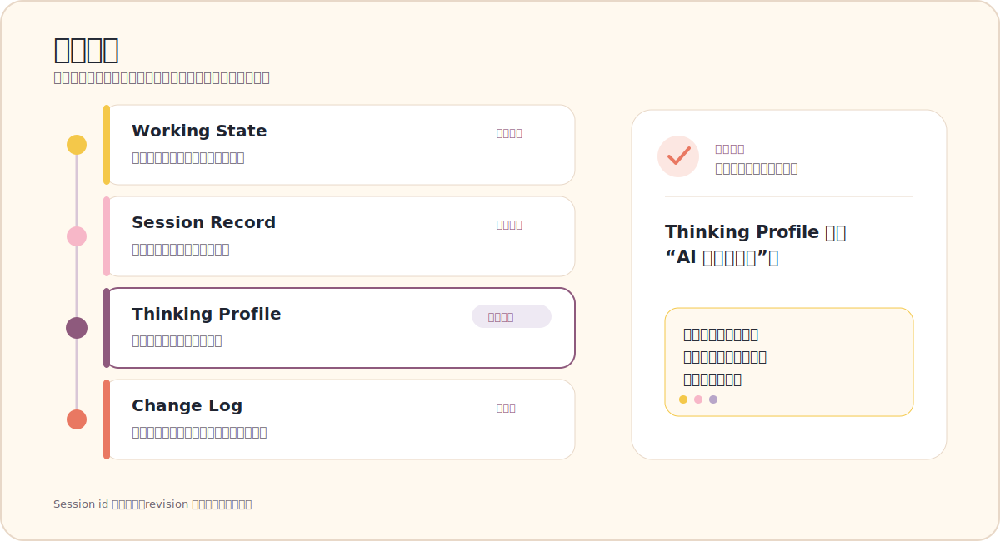

<p align="right">
  <a href="./README.md">English</a> | 中文
</p>

<p align="center">
  
</p>

<h1 align="center">Review Your Thinking</h1>
<p align="center"><strong>一个用于长期 AI 对话的自我复盘 Skill。</strong></p>
<p align="center">v0.1-base · 实验阶段</p>

## 为什么做这个项目

AI 很擅长回答问题，但一段长对话真正值得留下来的，往往不只是答案。

有时候，我们在谈着谈着才发现：原来问题问错了，某个默认假设并不成立，或者一个一直说不清的概念终于有了更准确的表达。过了一段时间再回头看，这些变化比当时得到的建议更有价值。

Review Your Thinking 想做的，就是把这条思考路径轻轻地接起来：帮助你整理眼前的想法，回看过去保存的会话，再看清自己的问题、假设、概念和思维模型是怎样变化的。

它不会替你定义“你是怎样的人”。哪些内容值得长期保留，最终由你决定。

## 它能做什么

- 把一团混乱的表达整理成问题、假设、张力和未知项；
- 回看你明确保存的 Session Record，比较前后表达发生了什么变化；
- 把可能值得保留的思维模型写成一条待确认的变更；
- 在下一次对话里，从上次真正停下来的地方继续。

它不是日记，也不是通用复盘模板。它关心的不是“今天完成了什么”，而是你如何重新定义一个问题、修正一个假设，或者放弃一套已经不再适用的理解。

## 它如何工作

<p align="center">
  
</p>

整个过程刻意保持克制：每轮只推进一个主要动作，不用一串问题审问你，也不会在你还没想清楚时急着给建议。

过去的会话只作为证据使用。Review Your Thinking 不假装拥有你的全部聊天历史，也不会默认读取或保存完整原始聊天记录。

## 一个小例子

你一开始可能只说：

```text
我对工作和自由有很多想法，但我不知道自己到底卡在哪里。
```

Review Your Thinking 不会马上给出职业建议，而是先和你一起把问题摊开：

| 看到的部分 | 当前表达 |
|---|---|
| **问题** | 我是在稳定和自由之间二选一，还是在寻找它们可以共存的条件？ |
| **假设** | 稳定增加多少，自由就一定减少多少。 |
| **张力** | 可靠的安全感与有意义的自主空间。 |
| **还不知道** | 我真正需要的最低安全边界是什么？ |
| **下一步追问** | 如果某种约束能保护未来的选择空间，我是否愿意接受它？ |

对话继续后，AI 也许会提出这样一条整理：

```text
待确认的思维模型：
自由也许不是没有约束，而是拥有选择约束的空间。
```

这只是一条 `proposed` 变更。你没有确认，它就不会进入 Thinking Profile。

## 记忆是怎样组织的

<p align="center">
  
</p>

Review Your Thinking 把“本轮正在想什么”“某次对话留下了什么”以及“哪些模型已经由你确认”分开保存。这样，一次偶然的表达不会悄悄变成长期画像，过去和现在的变化也能找到来源。

其中有三种状态必须始终分清：

- `observed`：能在某次 Session Record 中定位到的表达；
- `proposed`：AI 根据证据提出的整理，仍然可以修改或拒绝；
- `confirmed`：你明确认可、愿意放入长期记录的模型。

`proposed` 不能自动升级为 `confirmed`。即使同一种表达出现过很多次，也仍然需要你的确认。

> **Thinking Profile 不是“AI 眼中的用户”。**  
> 它是用户当前认可、并允许未来继续修订的思维模型集合。

## 它刻意不做什么

- 不做心理咨询，也不能替代现实中的专业支持；
- 不做心理诊断、人格分析、MBTI 或能力评分；
- 不从一句话推断你的稳定特征；
- 不默认保存完整聊天记录；
- 不把 AI 的猜测写成关于你的事实；
- 不在用户确认前更新 Thinking Profile。

## 快速开始

需要 Python 3.10 或更高版本。

```bash
pip install pyyaml
python scripts/memory_store.py init
python scripts/memory_store.py close examples/sample-session.md
python scripts/memory_store.py review examples/sample-past-session-01.md examples/sample-past-session-02.md
python scripts/memory_store.py validate
```

这些命令会：

1. 在当前目录创建 `.review-your-thinking/` 本地记忆目录；
2. 保存一份结构化的 Session Record 和 pending Patch；
3. 根据明确选择的过去会话生成复盘草稿；
4. 检查文件结构、状态、revision 和基础 evidence 引用。

`.review-your-thinking/` 保存的是用户数据，默认不会进入 Git。

## 项目结构

```text
.
├── assets/                 # README 使用的中英文 SVG
├── examples/               # 虚构会话与 Patch 示例
├── references/             # 对话、记忆、更新与安全规则
├── schemas/                # Profile / Thread / Session / Patch
├── scripts/
│   └── memory_store.py     # 最小本地 Memory CLI
├── tests/
│   └── acceptance/         # 防止产品意图漂移的验收用例
├── ARCHITECTURE.md
├── README.md
├── README.zh-CN.md
└── SKILL.md
```

## 验收测试

[`tests/acceptance/`](./tests/acceptance/) 里的用例不是为了追求测试数量，而是为了守住几个容易跑偏的地方：

- 不把项目做成普通日记或通用复盘；
- 不把思维整理写成人格分析或类心理咨询回答；
- 不根据单次表达过度画像；
- 不把沉默、重复出现或看似同意当作确认；
- 不在用户明确确认前更新 Thinking Profile。

## 当前状态

当前版本是 **v0.1-base**，仍处于实验阶段。

仓库已经包含可运行的本地 Memory 流程、AI Skill 协议、结构化 schema 和验收用例。它还不具备后台聊天访问、自动语义分析、云同步或托管应用能力。

## 参与贡献

如果你也对“长期对话里，思考是怎样变化的”感兴趣，下面这些材料会很有帮助：

- 一段很难整理清楚的想法；
- 一个值得回看的过去会话示例；
- Skill 过度推断或说得太满的反例；
- 一条让人觉得“不像自己”的 proposed Patch；
- 更准确的中文表达或验收用例。

提交示例前，请先移除真实姓名、联系方式和其他敏感信息。

## License

License: TBD
